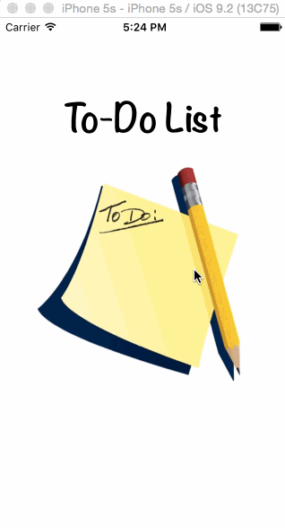

# To-Do List

##Description:
A simple to-do list app written in Swift. This app was built to learn the concepts of some of XCode's core features (e.g. ViewController, Navigation Controller, Delegates, etc).

##Demo:

